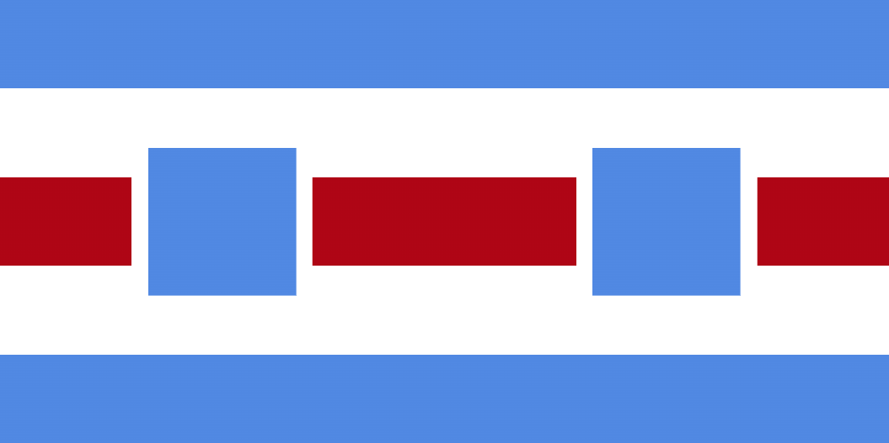

# CSS Flags

Recreating various flags using HTML & CSS.

## Utilities

### Adding a flag

Build `utils/make_flag.go` with `go build -o utils/make_flag.exe utils/make_flag.go`. Then run `make_flage.exe` with `./utils/make_flag.exe -o "Country Name"` then follow the instructions.

### Solving Suns

For stars with a large number of points (more than 5, those that might also be called a sun), construction is often described by only an inner and outer radius (as well as the number of rays that fully surround the center). The angle of each ray must be calculated to create a `conic-gradient` for that ray. In these cases, use `utils/generate_sun`. This will provide the angles for the rays and, if possible (number of rays is even), generate CSS code for the rays.